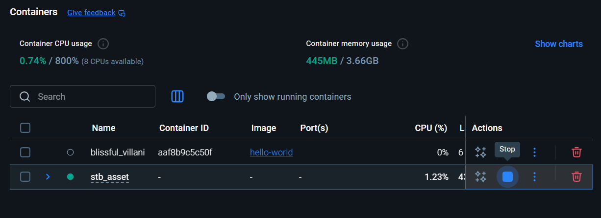
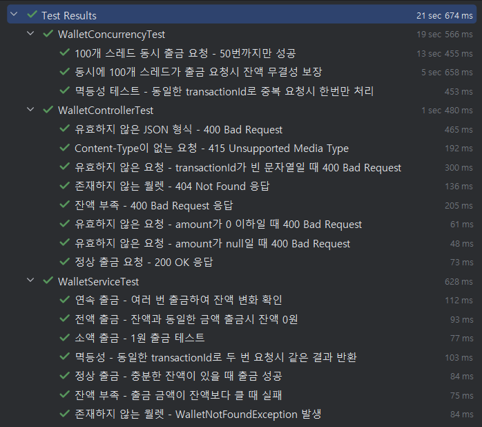
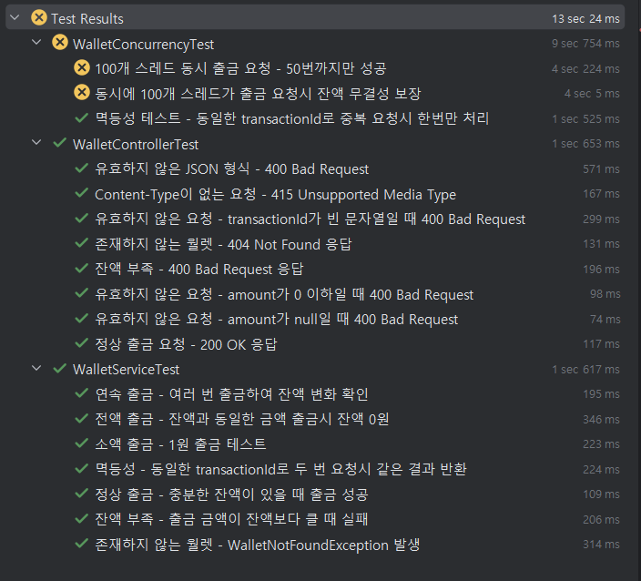

# 월렛 동시 출금 및 잔액 무결성 보장 시스템

## 1. 프로젝트 및 인프라 기동 방법

### 프로젝트 빌드 및 실행
```bash
./gradlew bootRun
```

### 데이터베이스 기동
- docker desktop 이 pc에 설치되어있다는 가정 하에 설명드립니다.

**local(개발) 환경 (Spring Boot Docker Compose Support)**:
```bash
# 애플리케이션 실행 시 MySQL 자동 시작
./gradlew bootRun
```

**테스트 환경 (로컬 MySQL)**:
- docker desktop 에서 stb_asset 실행한 후 테스트 실행
- (매 테스트마다 docker 를 실행/종료하는 시간 save를 위함)



```bash
# MySQL 컨테이너가 실행 중인 상태에서 테스트 실행
./gradlew test
```

- 애플리케이션 시작 시 테이블 자동 생성 (`ddl-auto: update`)
- 테스트 시에만 초기 월렛 데이터 생성 (wallet1: 1,000,000원, wallet2: 500,000원, wallet3: 100,000원)


## 2. 설계 결정

### 기술 스택
- **Language**: Java 21
- **Framework**: Spring Boot 3.2.0
- **Database**: MySQL 8.0
- **ORM**: Spring Data JPA

### 1. 동시성 제어 기법
**Pessimistic Lock (비관적 락) 선택**

**선택 이유**:
- `SELECT FOR UPDATE`를 통한 명시적 행 레벨 락
- 완벽한 데이터 무결성 보장
- 구현 단순성 및 예측 가능성

**구현 방식**:
```java
@Lock(LockModeType.PESSIMISTIC_WRITE)
@Query("SELECT w FROM Wallet w WHERE w.walletId = :walletId")
Optional<Wallet> findByWalletIdWithLock(@Param("walletId") String walletId);
```

### 2. 멱등성 보장
**DB 제약으로 선점 방식**
- `wallet_id + transaction_id` 복합 유니크 인덱스
- PROCESSING 상태로 선점 INSERT 시도 (`saveAndFlush()` 사용)
- `DataIntegrityViolationException` 발생 시 기존 트랜잭션 반환
- 레이스 컨디션 완전 방지

### 3. 상태 머신 및 안전성
**트랜잭션 상태 코드 관리 (TransactionStatusCode)**
- **00**: PROCESSING (처리 중)
- **10**: SUCCESS (출금 성공)
- **20**: INSUFFICIENT_BALANCE (잔액 부족)
- **21**: WALLET_NOT_FOUND (월렛 없음)
- **99**: UNKNOWN_ERROR (알 수 없는 오류)

**장점**:
- 완벽한 데이터 무결성
- 실패 요청도 기록 보존
- 장애 상황에서 유실 방지

**단점**:
- 처리량 제한 (직렬화로 인한 50-100 TPS)
- 락 대기로 인한 응답시간 증가

### 4. 우려사항 및 향후 대책

**현재 우려사항**:
- 단일 월렛에 대한 처리량 제한
- 락 대기 시간으로 인한 사용자 경험 저하

**향후 개선 방안**:
- Redis 분산 락을 통한 선행 필터링
- 읽기 전용 조회 API 분리
- 비동기 처리 도입

### 3. API 테스트
```bash
# 출금 요청 (테스트 데이터의 wallet1 사용)
curl -X POST http://localhost:8080/api/wallets/wallet1/withdraw \
  -H "Content-Type: application/json" \
  -d '{
    "amount": 10000,
    "transactionId": "TXN_UUID_12345"
  }'
```

## 테스트 실행

### 동시성 테스트
```bash
./gradlew test --tests "*ConcurrencyTest"
```

**테스트 시나리오**:
1. **동시성 테스트**: 100개 스레드가 동시에 10,000원씩 출금 요청
2. **멱등성 테스트**: 동일한 transactionId로 중복 요청 시 한 번만 처리
3. **제한된 출금 테스트**: 100개 요청 중 50번만 성공하는 시나리오

**검증 항목**:
- 최종 잔액이 0원 미만이 되지 않는지 검증
- 총 출금 금액이 초기 잔액을 초과하지 않는지 검증
- 모든 트랜잭션이 기록되는지 검증

## API 명세

### 출금 API
- **Endpoint**: `POST /api/wallets/{walletId}/withdraw`
- **Request Body**:
```json
{
  "amount": 10000,
  "transactionId": "TXN_UUID_12345"
}
```
- **Response**:
```json
{
  "walletId": "wallet1",
  "transactionId": "TXN_UUID_12345",
  "amount": 10000,
  "balanceAfter": 990000,
  "status": "10",
  "timestamp": "2024-01-01T10:00:00"
}
```
- **HTTP 상태 코드**:
  - 성공 (10): 200 OK
  - 잔액 부족 (20): 400 Bad Request
  - 월렛 없음 (21): 404 Not Found
  - 처리 중 (00): 202 Accepted
  - 알 수 없는 오류 (99): 500 Internal Server Error

## 데이터베이스 스키마

### Wallet 테이블
```sql
CREATE TABLE wallet (
    wallet_id VARCHAR(50) PRIMARY KEY,
    balance DECIMAL(19,2) NOT NULL,
    created_at TIMESTAMP DEFAULT CURRENT_TIMESTAMP,
    updated_at TIMESTAMP DEFAULT CURRENT_TIMESTAMP ON UPDATE CURRENT_TIMESTAMP
);
```

### WalletTransaction 테이블
```sql
CREATE TABLE wallet_transaction (
    id BIGINT AUTO_INCREMENT PRIMARY KEY,
    wallet_id VARCHAR(50) NOT NULL,
    transaction_id VARCHAR(100) NOT NULL,
    amount DECIMAL(19,2) NOT NULL,
    balance_after DECIMAL(19,2),
    status VARCHAR(2) NOT NULL DEFAULT '00',
    created_at TIMESTAMP DEFAULT CURRENT_TIMESTAMP,
    updated_at TIMESTAMP DEFAULT CURRENT_TIMESTAMP ON UPDATE CURRENT_TIMESTAMP,
    UNIQUE(wallet_id, transaction_id)
);
```


## 3. 테스트 결과
- 동시성 테스트 실행 결과



- 동시성 미적용 후 실행 결과
```java
//    @Lock(LockModeType.PESSIMISTIC_WRITE)
@Query("SELECT w FROM Wallet w WHERE w.walletId = :walletId")
Optional<Wallet> findByWalletIdWithLock(@Param("walletId") String walletId);
```

